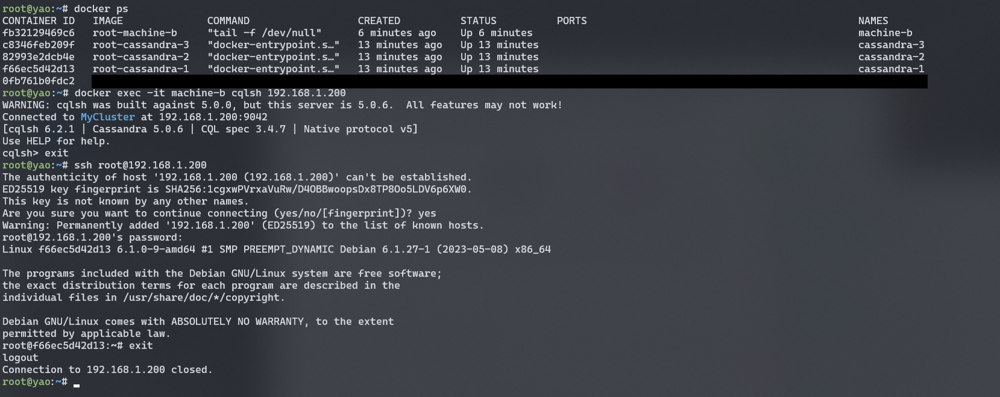

на хосте выполнить

```
sudo ip link add mv-bridge link eth0 type macvlan mode bridge
sudo ip addr add 192.168.1.210/24 dev mv-bridge
sudo ip link set mv-bridge up
sudo ip route add 192.168.1.200 dev mv-bridge

docker compose up --build -d

docker exec -it machine-b cqlsh 192.168.1.200

ssh root@192.168.1.200
```

итог
